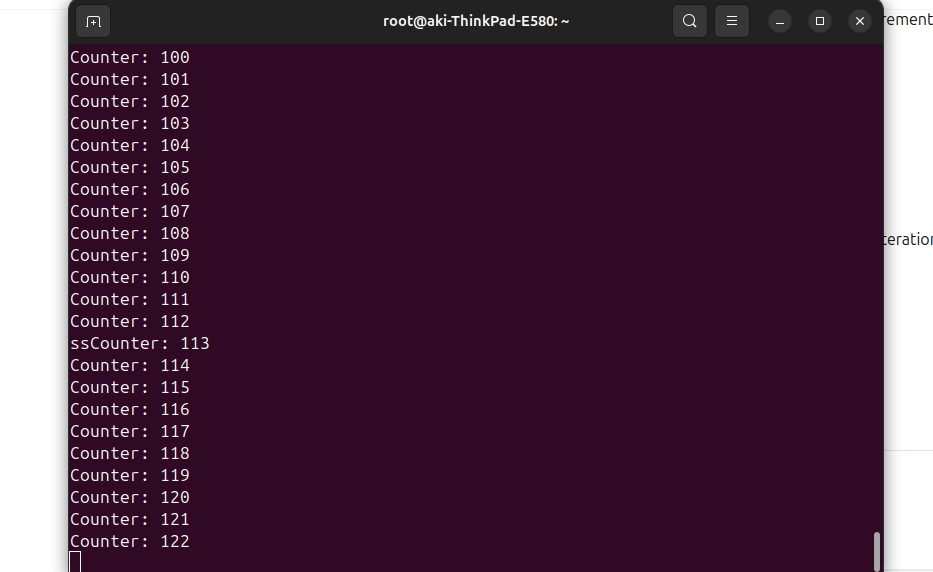
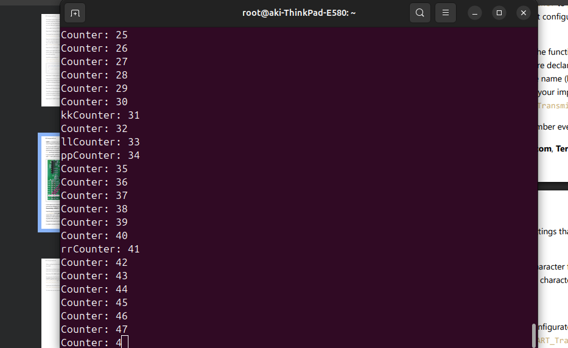

# ERS-Assignment01 

This report provides an explanation of the exercises implemented in the ERS-Assignment01. Each exercise demonstrates different functionalities using the STM32 microcontroller, including LED control, button input, UART communication, and more.

---
# I left out Exercise 1 and 2 is mainly concerned with STM32CubeIde software installation and configurations
## Exercise 3 (ex3.c)

### Description:
This exercise initializes the STM32 microcontroller and controls the onboard LEDs. The green LED is turned on initially, while the blue and red LEDs are turned off. The program then enters an infinite loop where the blue and red LEDs blink alternately with a 1-second delay.

### Key Features:
- **LED Control**: The green LED is turned on, and the blue and red LEDs blink alternately.
- **HAL Library**: Uses the Hardware Abstraction Layer (HAL) to control GPIO pins and manage delays.

### Code Explanation:
- The `HAL_GPIO_WritePin` function is used to set or reset the GPIO pins connected to the LEDs.
- The `HAL_Delay` function introduces a 1-second delay between LED toggles.

---

## Exercise 4 (ex4.c)

### Description:
This exercise extends the LED control functionality by cycling through four different LED states: green, orange, red, and orange again. The LEDs change every second, and the sequence repeats indefinitely.

### Key Features:
- **LED Sequence**: The program cycles through four LED states in a specific sequence, Green, Orange, Red and Orange.
- **State Management**: Uses a `currentLed` variable to keep track of the current LED state.

### Code Explanation:
- The `currentLed` variable is incremented and reset using modulo arithmetic to cycle through the LED states.
- The `HAL_GPIO_WritePin` function is used to turn on the appropriate LED based on the `currentLed` value.

---

## Exercise 5 (ex5.c)

### Description:
This exercise introduces button input to control the LED sequence. The program has three modes: clockwise, counter-clockwise, and all LEDs blinking together. The mode changes when the button is pressed.

### Key Features:
- **Button Input**: The button press is debounced to avoid multiple triggers.
- **Multiple Modes**: The program supports three modes for LED control.
- **State Management**: Uses a `mode` variable to track the current mode.

### Code Explanation:
- The `HAL_GPIO_ReadPin` function reads the button state, and debouncing is implemented using a timestamp.
- The `mode` variable is incremented and reset using modulo arithmetic to cycle through the modes.

---

# Exercise 6 (ex6.c)

### Description:
This exercise builds on previous LED control exercises by introducing an external interrupt to handle button presses. The program cycles through three modes: clockwise LED sequence, counter-clockwise LED sequence, and all LEDs blinking together. The mode changes when the button is pressed, and the button press is handled using an external interrupt.

Note: Set PA0 functionality to GPIO_EXTI0. Under System core -> GPIO, configure PA0 to “External Interrupt Mode with rising edge trigger detection”. Under System core -> NVIC, enable the EXTI line 0 interrupt. (Reference from assignment document)

### Key Features:
- **External Interrupt**: The button press is handled using an external interrupt (EXTI) to change the mode.
- **Multiple Modes**: The program supports three modes for LED control:
  1. **Clockwise Sequence**: Green → Orange → Red → Blue.
  2. **Counter-clockwise Sequence**: Blue → Red → Orange → Green.
  3. **All LEDs Blink Together**: All LEDs toggle simultaneously every 500ms.
- **State Management**: Uses a `mode` variable to track the current mode and a `ledState` variable to manage the LED sequence.

### Code Explanation:
- **External Interrupt**: The `HAL_GPIO_EXTI_Callback` function is used to handle the button press interrupt. When the button is pressed, the `mode` variable is incremented, cycling through the three modes.
- **LED Control**:
  - In **Mode 0 (Clockwise)**, the LEDs are turned on in the sequence: Green → Orange → Red → Blue.
  - In **Mode 1 (Counter-clockwise)**, the LEDs are turned on in the sequence: Blue → Red → Orange → Green.
  - In **Mode 2 (All Blink)**, all LEDs toggle on and off together every 500ms.
- **Debouncing**: The program waits for the button to be released after a press to avoid multiple triggers.
- **Timing**: The `HAL_GetTick` function is used to manage timing for LED toggling and debouncing.

## Exercise 7 (ex7.c)

### Description:
This exercise builds on Exercise 5 by adding a dimming feature to the LEDs with 100 ms delay. The dimming level can be changed using a long press of the button, while a short press changes the LED sequence mode.

### Key Features:
- **Dimming Control**: The LEDs can be dimmed to 100%, 75%, 50%, or 25% brightness.
- **Button Long Press**: A long press changes the dimming level, while a short press changes the mode ,clockwise, counter-clockwise, and all LEDs blinking together.

### Code Explanation:
- The `dimmingLevel` variable is used to track the current dimming level.
- The `dimmingCounter` variable is used to implement PWM-like dimming by toggling the LEDs at different intervals.

---

## Exercise 9 (ex9.c)

### Description:
This exercise demonstrates UART communication. The program initializes UART and prints an increasing counter starting from 0 value every second. It also echoes any received characters back twice.

Note: In this exercise you should initialize and use UART so that you can use printf to print to the serial console
and see the messages on your PC. To do so, setup the UART in the project configuration. It is done under
Connectivity->USART2. Choose the Asynchronous mode. (Reference from assignment document) . I used minicom, to connect the board in serial mode which can be installed using sudo apt install minicom -y using terminal where i used ubuntu OS.

### Key Features:
- **UART Communication**: The program uses UART to send and receive data.
- **Echo Mode**: Any received character is echoed back twice in the terminal.

### Code Explanation:
- The `HAL_UART_Transmit` and `HAL_UART_Receive` functions are used for UART communication.
- The `printf` function is overridden to use UART for output.

---

## Exercise 10 (ex10.c)

### Description:
This exercise extends the UART functionality by using interrupt-based communication. The program prints an increasing counter value every second starting from 0 with led blink respectively and echoes received characters back twice using interrupts.

Note: Use of interrupts for UART. In the configurator, enable activate the USART2 global interrupt under NVIC settings. (Reference from assignment document)

### Key Features:
- **Interrupt-Based UART**: The program uses UART interrupts for receiving and transmitting data.
- **Echo Mode**: Any received character is echoed back twice using interrupts.

### Code Explanation:
- The `HAL_UART_Receive_IT` and `HAL_UART_Transmit_IT` functions are used for interrupt-based UART communication.
- The `HAL_UART_RxCpltCallback` and `HAL_UART_TxCpltCallback` functions handle UART receive and transmit interrupts, respectively.

---
